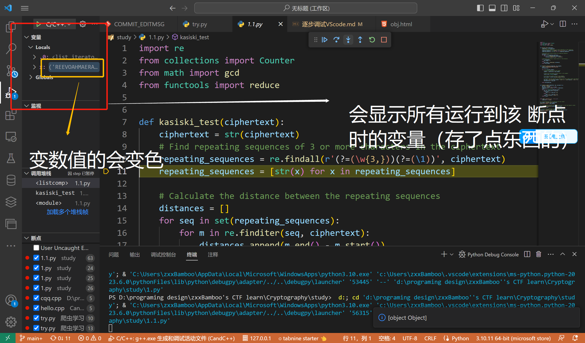
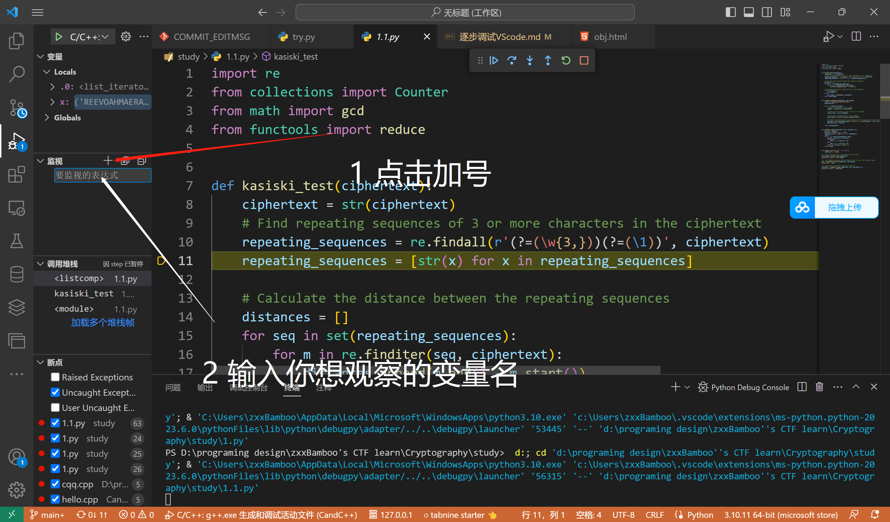
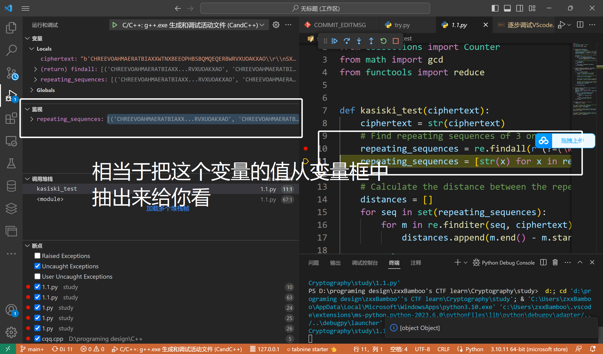
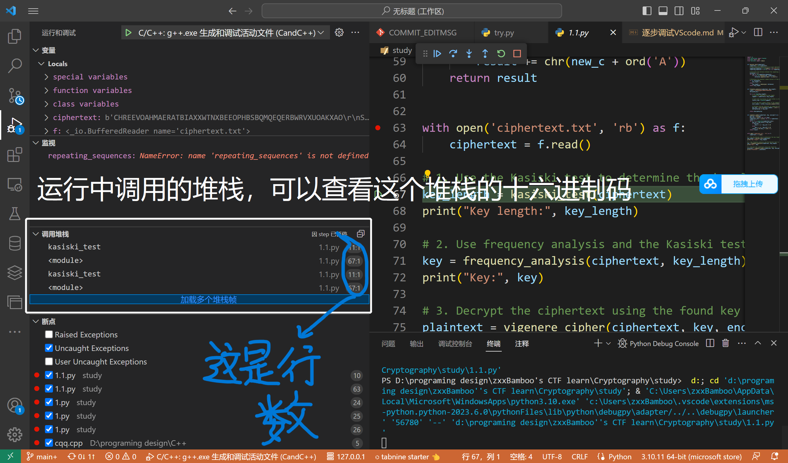
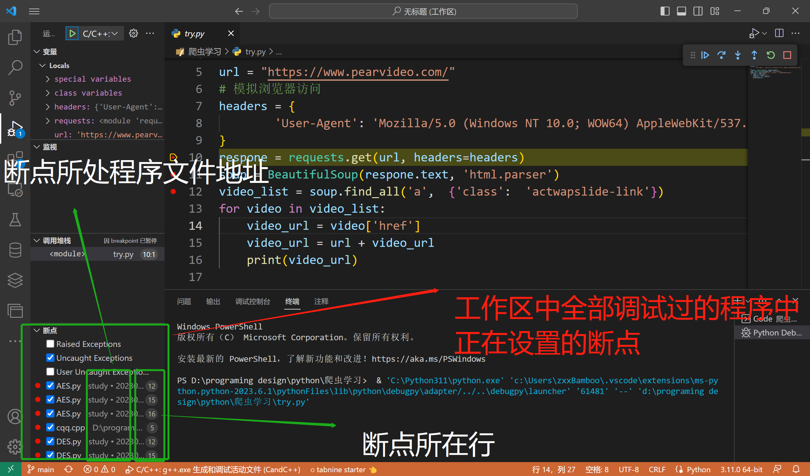
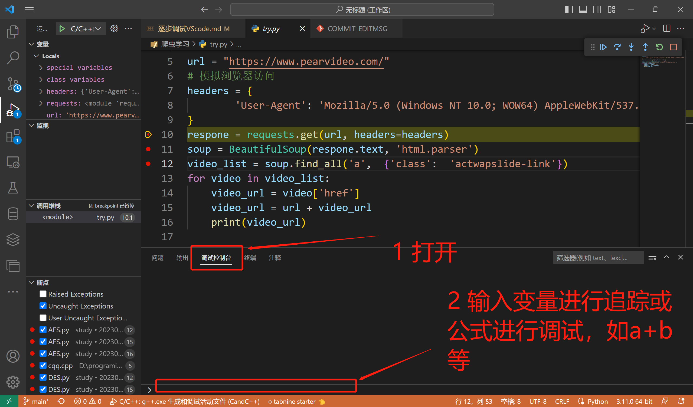
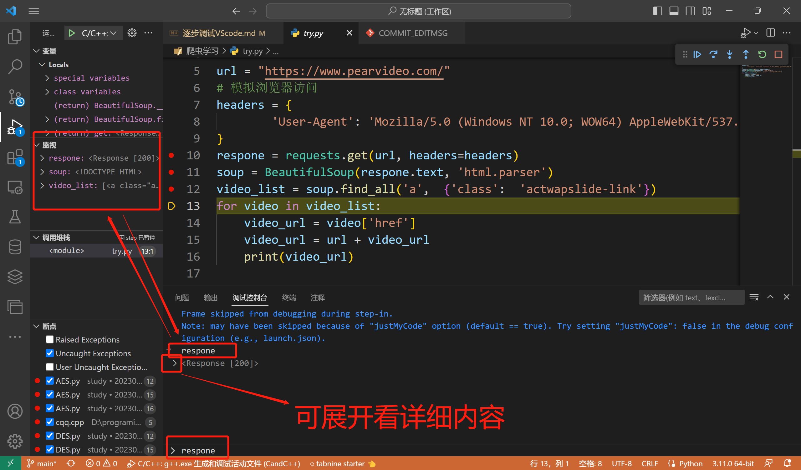
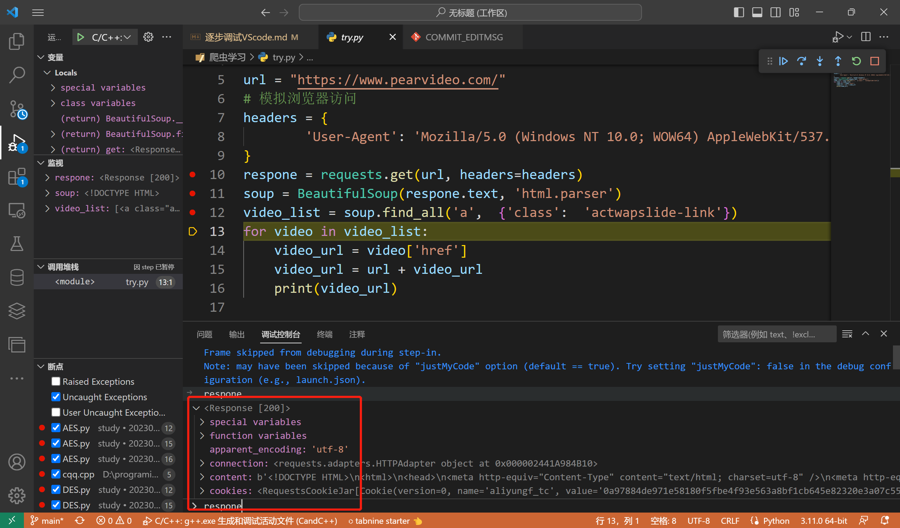
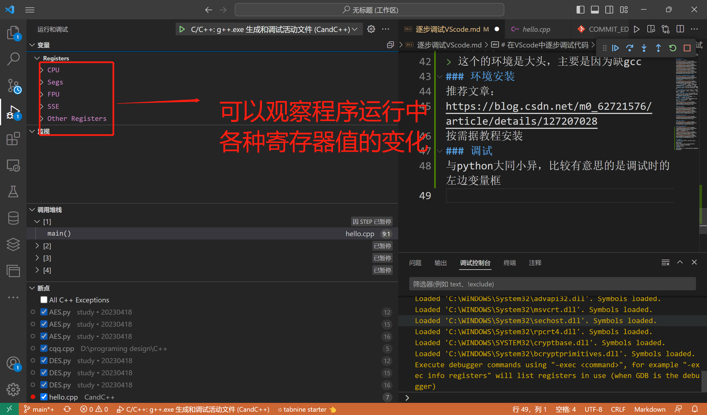

[TOC]
# 在VScode中逐步调试代码
> 文主之前一直不会调试VScode，今天下定决心一定要搞懂他。本文将列出文主目前会得的一点皮毛语言举例。欢迎也有此苦恼的同学与文主一起拨开迷雾见青云！

## 调试python
### step 1 开始调试
  
  
  
  

### step2 介绍调试时比较好玩的功能
  
#### 调试条框
  
- **继续F5**：直接执行到下一个断点处，若无断点则直接执行完剩下的全部过程。
- **单步跳过F10**：当光标到达有函数的指令时，点击即运行完该函数，直接到下一条指令
- **单步调试F11**：前提为已经在一个断点处停下，从此断点开始点击一次，运行一条指令（一行代码）
- **单步跳出shift+F11**：当单步调试进入函数体中时，点击即可跳回到即将进入函数中的那条指令，此时该函数未执行
- **重启ctrl+shift+F5**：重新开始执行代码到第一个断点位置停下
- **停止shift+F5**：结束调试代码，直接推出该过程，此时没有执行代码
#### 左栏变量框
  

#### 左栏监视框
  
  

#### 左栏调用堆栈框
  

#### 左栏断点框
  

#### 下方调试控制台
  
下面是简单的调试演示：
  
  

## 调试C/C++
> 这个的环境是大头，主要是因为缺gcc
### 环境安装
推荐文章：
https://blog.csdn.net/m0_62721576/article/details/127207028
按需据教程安装
### 调试
与python大同小异，比较有意思的是调试时的左边变量框
  

## 调试Java
### 环境安装
https://blog.csdn.net/LKFMYQQ/article/details/120519567
vscode扩展安装：Java Extension Pack(包含插件Java Debugger for Visual Studio Code+插件Language Support for Java™ by Red Hat)
### 调试步骤
1. 准备项目。打开一个 .java 文件，Java 扩展会激活。Maven、Gradle 和 Eclipse 项目都能得到支持。这个扩展会自动构建项目，不需要手工触发构建。

2. 开始调试。切换到调试视图(Ctrl+Shift+D)，打开 launch.json 并添加 Java 调试配置。

3. 在 mainClass 中填入要启动的类，或者在hostName 中填入要附加的主机名以及在 port 中填入端口。

4. 设置断点并按 F5 开始调试

剩下操作与python大同小异

________________________________
~~懒了，php，vue，go，R那些不想写了,除了环境都差不多~~
算了，php也给个地址吧：https://blog.csdn.net/qq_44803335/article/details/108806851

**又到了题主喜闻乐见的交友时刻（喜）**
## 资料共和学习白嫖群，资料全弄的网盘的：
  
还有群主的每日打卡以此来下饭促学（喜）
## chatgpt plus 共和合用群
  

## 题主的Offensive Security系列之路
  
有意愿来玩的或者来见证群主痛苦的来！群主愿意做你的共学伙伴（喜）一起的话还有每天的撅醒服务（悲）